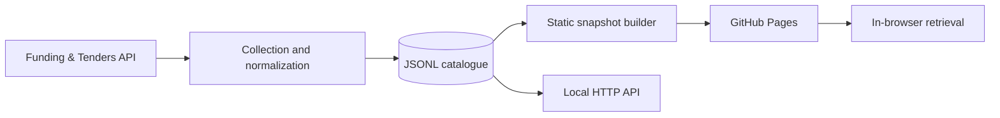

# EU Opportunity Finder

A collection and retrieval system for European Commission grants and procurement notices. It maintains a normalized opportunity catalogue and publishes an explainable project-matching interface as a static site.

[Live portal](https://alessandropozzetti.github.io/eu-funding-opportunities/) · [Architecture](docs/architecture.md) · [API contract](docs/api.md) · [Data model](data/README.md) · [Retrieval evaluation](evaluation/README.md)

## System overview



The Python runtime uses the standard library. The public client is plain JavaScript with locally served assets; it requires no application server, API credentials or external inference service. Project descriptions remain in the browser on the public portal.

- **Collection:** grant and tender queries, source-document coverage checks, two consecutive concordant scans, deterministic version resolution and atomic catalogue replacement.
- **Lifecycle:** stable source identities, change timestamps and retained records for opportunities no longer listed by the source.
- **Retrieval:** field-weighted lexical scoring, concept aliases, priority phrases, length normalization and explicit missing-topic evidence.
- **Delivery:** nightly collection at 21:00 `Europe/Rome`, followed by validation, static generation and GitHub Pages deployment. Workflow execution time is best-effort.

## Development

Requirements: Python 3.10+ and Node.js for the JavaScript tests. No package installation is required.

```bash
python3 -m bandi_eu audit
python3 -m bandi_eu serve
```

The local interface is available at `http://127.0.0.1:8000`. The checked-in catalogue can be used without accessing the upstream API. To refresh it or build the static distribution:

```bash
python3 -m bandi_eu sync
python3 -m bandi_eu build-site --output public_site
```

An alternative catalogue path can be supplied before the subcommand:

```bash
python3 -m bandi_eu --data path/to/opportunities.jsonl audit
```

## Verification

```bash
python3 -m unittest discover -s tests -v
node tests/test_matcher.js
python3 scripts/evaluate_matcher.py --check
```

Tests cover pagination overlap, legitimate index versions, silently filtered totals, source changes during collection, atomic failure semantics, record lifecycle, date handling, HTTP contracts, static export and Python/JavaScript retrieval parity. The [collection validation record](docs/collection-validation.md) documents verification against real API responses. The retrieval regression suite uses a fixed corpus of 339 records with 16 English scenarios and two supplementary Italian alias checks. Its judgments are development fixtures, not an independent estimate of retrieval accuracy.

Pull requests run verification and a static build. The collection workflow applies the same retrieval gates before updating the public site.

## Repository layout

| Path | Responsibility |
| --- | --- |
| `bandi_eu/core.py` | Upstream client, normalization, persistence and active-record predicate |
| `bandi_eu/matching.py` | Python retrieval engine and evidence extraction |
| `bandi_eu/matching_config.json` | Shared concept vocabulary and query normalization configuration |
| `bandi_eu/site.py` | Public data projection and static distribution builder |
| `bandi_eu/web.py` | Local HTTP server and API |
| `web/` | Interface, browser retrieval engine and self-hosted assets |
| `data/` | Normalized source catalogue and schema documentation |
| `evaluation/` | Frozen corpus, relevance fixtures, baseline and comparison report |
| `tests/` | Unit, integration and retrieval parity tests |
| `docs/` | Architecture and interface contracts |

## Scope

The catalogue covers the selected categories of the [Funding & Tenders Portal](https://ec.europa.eu/info/funding-tenders/opportunities/portal/screen/home). Procurement coverage is not the full [TED](https://ted.europa.eu/) corpus. Records with unknown deadlines, expired deadlines or a non-open status are excluded from the public snapshot.

Retrieval is English-first and dictionary-assisted. The displayed 0–100 index is uncalibrated and query-dependent. It measures text evidence; it does not assess applicant eligibility, project admissibility or award probability. Unsupported synonyms, negation, incomplete source descriptions and incidental mentions remain relevant error modes. See the [evaluation protocol](evaluation/README.md) for definitions and limitations.

Changes to collection semantics, public fields or ranking behavior should follow the [contribution guidelines](CONTRIBUTING.md).
